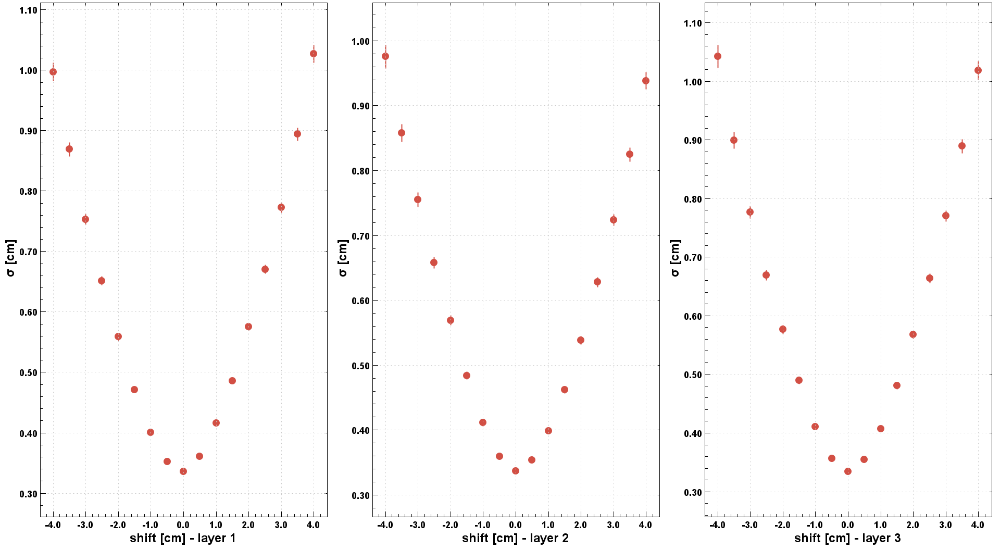
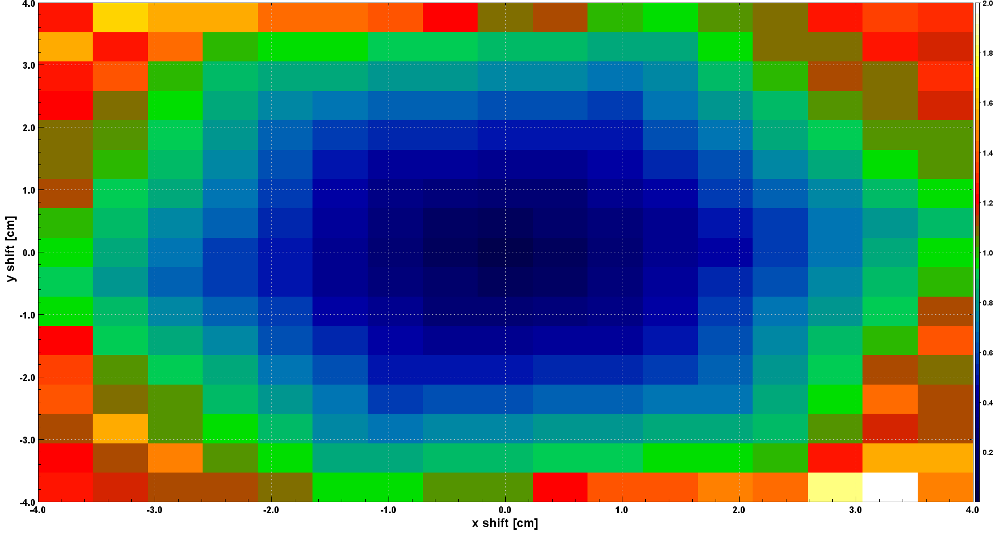
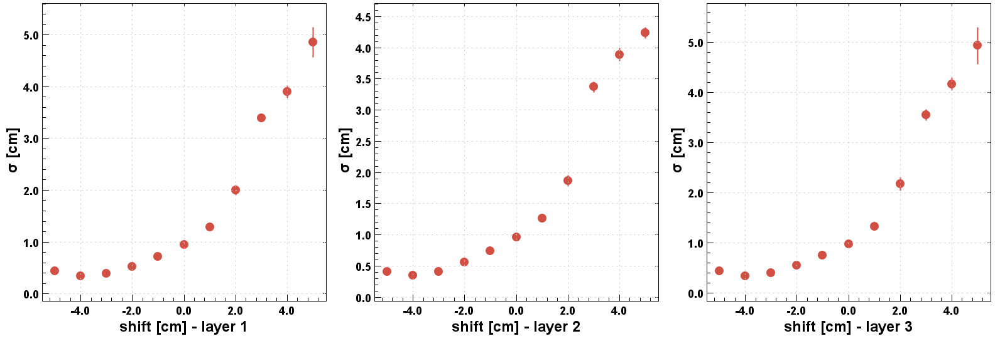
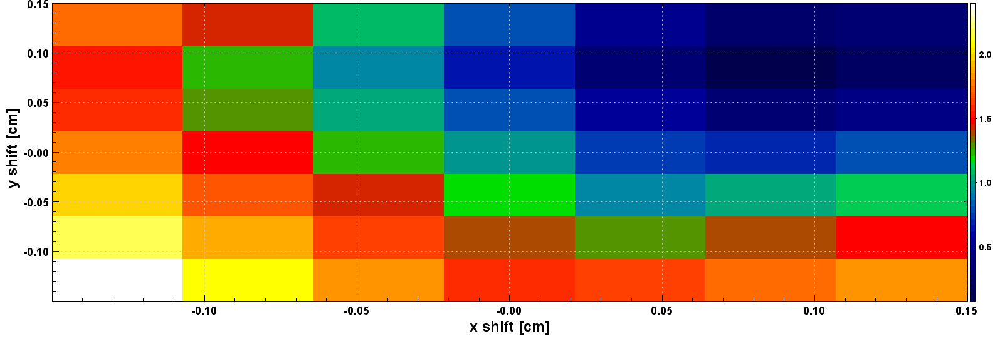
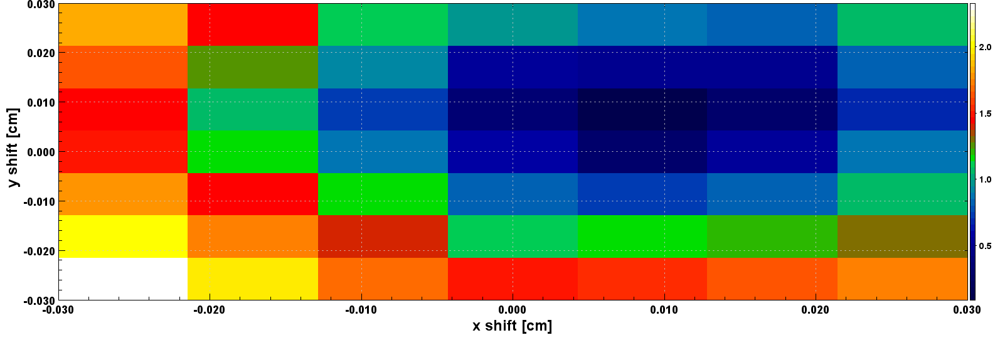

# FMT Alignment
Code used for the FMT detector alignment using residual analysis. A residual is
the distance between an FMT cluster of hits and a DC track in the FMT layer's
local coordinate system.

## Alignment algorithm
The position of each FMT layer is adjusted by minimizing the residuals between
the reconstructed FMT clusters and the DC track trajectory point. The values of
the misalignment parameters are identified by performing subsequent scans of z
translations, z rotations, xy translations and xy rotations, fitting the
residuals for each set of misalignments and selecting the values for which the
mean or sigma of the fit are minimal. Multiple iterations can be performed to
account for correlations between the parameters.

Because of the 1D strip readout of the FMT layers, while z misalignment can be
optimized for each layer independently, xy misalignments can be studied only if
at least two layers are simultaneously displaced or rotated. For this reason, z
misalignments are defined per layer, while the same xy misalignments are applied
to the whole detector.

## Prerequisites
* Software:
    * A Linux or Mac computer.
    * Java Development Kit 11 or newer.
    * Maven.
* Data:
    * Beam data with electron tracks in the forward detector and the following
    banks: `RUN::config`, `REC::Event`, `REC::Particle`, `REC::Track`,
    `REC::Trajectory`, `FMT::Hits`, `FMT::Clusters`, and `FMT::Tracks`.
    * A recent Sqlite snapshot of CCDB (see
    https://clasweb.jlab.org/clas12offline/sqlite/ccdb/).

## Setup
Compile the code with the command
```mvn instal```

You are now ready to run the code running the script ```bin/fmt-alignment```.

**Note**. By default, the program assumes the number of FMT layers to be 3. If
this changes, change the `FMTLAYERS` variable in `src/.../test/Constants.java`
to the new value.

## Usage
```
Usage: $0 infile\n
       [-n/--nevents n] [-v/--var v] [-i/--inter r s] [-s/--swim s t h]
       [-V/--variation v] [-p/--plot p] [-c/--cutsinfo c]
       [-x/--dx x1 x2 x3] [-y/--dy y1 y2 y3] [-z/--dz z1 z2 z3]
       [-X/--rx x1 x2 x3] [-Y/--ry y1 y2 y3] [-Z/--rz z1 z2 z3]

    infile
        input hipo file
    -n, --nevents n
        number of events to run. If unspecified, runs all events in the in-
        put hipo file
    -v, --var v
        variable to be aligned, can be `dXY`, `dZ`, `rXY`, or `rZ`
    -i, --inter r s
        * r: range between nominal position and position to be tested
        * s: step size for each tested value between <nominal - range> and
        <nominal + range>
    -s, --swim s t h
        setup for the Swim class, defining scales and shift
        * s: solenoid magnet scale (default: -0.75)
        * t: torus magnet scale (default -1.0)
        * h: solenoid magnet shift (default: 3.0)
    -V, --variation v
        string specifying the CCDB variation to be used; default value is
        `rgf_spring2020`
    -p, --plot p
        integer defining if produced plots should be plotted or not; set to
        1 to show them, 0 to not; in both cases, produced plots are stored
        in the `histograms.hipo` file.
    -c, --cutsinfo c
        define how much data about the cuts applied should be printed to
        stdout; default is 1
        * 0: don't print any cuts data
        * 1: print a minimal set of information
        * 2: print a detailed report on the effect of the cuts applied
    -x, --dx x1 x2 x3
        x shift for each FMT layer
    -y, --dy y1 y2 y3
        y shift for each FMT layer
    -z, --dz z1 z2 z3
        z shift for each FMT layer.
    -X, --rx x1 x2 x3
        x rotation for each FMT layer.
    -Y, --ry y1 y2 y3
        y rotation for each FMT layer.
    -Z, --rz z1 z2 z3
        z rotation for each FMT layer.

Fit FMT hits to DC tracks, assigning different shifts and rotations to each
FMT layer each time. Alternatively, when no optional argument is specified,
plot the residuals of each layer.

For example, if called with:
    ./run.sh infile -v dZ -i 0.2 0.1 --dz 0.3 0.5 0.7 -dx 0.3 0.4 0.5
the tested values for each FMT layer's z shift will be
    layer 1: (0.1 0.2 0.3 0.4 0.5)
    layer 2: (0.3 0.4 0.5 0.6 0.7)
    layer 3: (0.5 0.6 0.7 0.8 0.9)
and each layer will be shifted in x by 0.3, 0.4, and 0.5, respectively. If
a position (--d*) or rotation (--r*) is not specified, it is assumed to be
0 for all FMT layers.

NOTE. All distance measurements are in cm, while in the CCDB they're sto-
red in mm.
```

## Results
After successfully running, the program produces either a 1D or a 2D plot,
depending on the type of alignment ran:
* For z alignment, a 1D plot of the deviation of the Gaussian fit against the
shift or rotation applied is shown for each FMT layer. For example:


* For xy alignment, a 2D plot of the mean average across layers against each
shift is shown. For example:


The most accurate shifts and rotations are the ones with the lowest means and
deviations, within acceptable error margins.

## Examples
### RG-M Run 15109 Alignment
See https://logbooks.jlab.org/entry/3947235. The validation plots can be
obtained running the script `fmtVertex.groovy` on data reprocessed with the
alignment constants.

### RG-F Run 12439 Alignment
First, let's perform dz alignment. To get rid of major misalignments, the
`run.sh` is executed with a large range and step size, e.g.:

```bash
./run.sh /path/to/out_clas_012439.hipo -n 100000 -v dZ -i 5.0 0.5
```

After the program runs, it shows

showing that the z shift for each layer is about -4.0 cm. Knowing this, a second
execution of the script is performed, including the found z shifts and a greater
number of events:

```bash
./run.sh /path/to/out_clas_012439.hipo -z -4.0 -4.0 -4.0 -n 1000000 -v dZ \
        -i 0.5 0.05
```

to get

from which the set of shifts (-3.75 -4.05 -3.85) can be concluded. Looking at
the error bars on the plot, it can be concluded that a much larger number of
events would be needed for more precise results.

The same procedure should be followed for rz alignment. For dxy, the following
parameters are added to the run script

```bash
./run.sh /path/to/out_clas_012439.hipo -z -3.75 -4.05 -3.85 \
        -Z -0.50 -0.50 -0.40 -n 100000 -v dXY -i 0.15 0.05
```

to get

from which a shift of 0.10 cm to x and y can be concluded. Further detail can be
squeezed in

```bash
./run.sh /path/to/out_clas_012439.hipo -z -3.75 -4.05 -3.85 \
        -Z -0.50 -0.50 -0.40 -x 0.10 0.10 0.10 -y 0.10 0.10 0.10 \
        -n 100000 -v dXY -i 0.03 0.01
```

to get

pushing the previously found shifts by 0.1 mm in the positive x and positive y
directions.

Remembering that the CCDB variables are stored in millimeters, a text file is
written detailing the shifts and rotations found as

```
# sector layer component deltaX deltaY deltaZ rotX rotY rotZ
  0      1     0         1.1    1.1    -37.5  0.0  0.0  -0.50
  0      2     0         1.1    1.1    -40.5  0.0  0.0  -0.50
  0      3     0         1.1    1.1    -38.5  0.0  0.0  -0.40
  0      4     0         0.0    0.0      0.0  0.0  0.0   0.0
  0      5     0         0.0    0.0      0.0  0.0  0.0   0.0
  0      6     0         0.0    0.0      0.0  0.0  0.0   0.0
```

## Pending work
* [ ] Make sure that `run.sh` runs on the farm.
* [ ] The format of histograms.hipo is not compatible with the latest hipo-browser.
* [ ] Upgrade the code so that it runs with coatjava 10.0.5.
* [ ] Upgrade the code to run with the same java version as coatjava 10.0.5.
* [ ] pom.xml uses old 6.5.3 version and doesn't show the plots after running run.sh. When updating to 10.0.5, shows an error:

```
Exception in thread "main" java.lang.NoSuchMethodError: 'void org.jlab.clas.swimtools.MagFieldsEngine.initializeMagneticFields()'
    at org.clas.analysis.TrkSwim.<init>(TrkSwim.java:22)
    at org.clas.analysis.ResolutionAnalysis.setupSwim(ResolutionAnalysis.java:90)
    at org.clas.analysis.ResolutionAnalysis.shiftAnalysis(ResolutionAnalysis.java:123)
    at org.clas.test.Main.main(Main.java:69)
```
