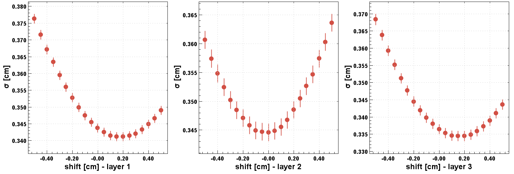

# FMT Alignment
Code used for the FMT detector alignment using residual analysis. A residual is the distance between
an FMT cluster of hits and a DC track in the FMT layer's local coordinate system. In case the README
and the usage of the program is not clear enough, a brief presentation with details on how to run is
included in this directory, named `usage_help.pdf`.

## Alignment algorithm
The position of each FMT layer is adjusted by minimizing the residuals between the reconstructed FMT
clusters and the DC track trajectory point. The values of the misalignment parameters are identified
by performing subsequent scans of z translations, z rotations, xy translations and xy rotations,
fitting the residuals for each set of misalignments and selecting the values for which the mean or
sigma of the fit are minimal. Multiple iterations can be performed to account for correlations
between the parameters.

Because of the 1D strip readout of the FMT layers, while z misalignment can be optimized for each
layer independently, xy misalignments can be studied only if at least two layers are simultaneously
displaced or rotated. For this reason, z misalignments are defined per layer, while the same xy
misalignments are applied to the whole detector.

## Prerequisites
* Software:
    * A Linux or Mac computer.
    * Java Development Kit 11 or newer.
    * A coatjava installation.
* Data:
    * Beam data with electron tracks in the forward detector and the following banks: `RUN::config`,
    `REC::Event`, `REC::Particle`, `REC::Track`, `REC::Trajectory`, `FMT::Hits`, `FMT::Clusters`,
    and `FMT::Tracks`.
    * A recent Sqlite snapshot of CCDB (see https://clasweb.jlab.org/clas12offline/sqlite/ccdb/).

## Setup
A minimal setup is required to run the program. In the `run.sh` file, three variables need to be set
* `TORUSMAP` and `SOLENOIDMAP` should point to the desired solenoid map appropriate for the run, and
* `COATJAVA` should point to the desired coatjava installation.

With this setup done, the script prints the programs' usage if it's ran without any parameters.

**Note**. By default, the program assumes the number of FMT layers to be 3. If this changes, change
the `FMTLAYERS` variable in `src/.../test/Constants.java` to the new value.

## Usage
    Usage: alignment <file> [-n --nevents]  [-s --swim] [-c --cutsinfo]
                            [-V --variation] [-p --plot] [-v --var] [-i --inter]
                            [-x --dx] [-y --dy] [-z --dz]
                            [-X --rx] [-Y --ry] [-Z --rz]

* **file**: The only positional argument. Denotes the path to the hipo input file to be used.
* **nevents**: Number of events to run. If unspecified, runs all events in input file.
* **swim**: Setup for the Swim class. Requires three parameters:
    1. Solenoid magnet scale. Default is -0.75.
    2. Torus magnet scale. Default is -1.0.
    3. Solenoid magnet shift. Default is 3.0.
* **cutsinfo**: Integer describing how much information on the cuts should be printed. 0 is no info,
1 is minimal, and 2 is detailed. Default is 1.
* **variation**: CCDB variation to be used. Default is `rgf_spring2020`.
* **plot**: Integer describing if plots are to be shown. Set to 0 to hide plots, to 1 to show them.
Whether they are shown on screen or not, they are always saved to the `histograms.hipo` file. *The
program has no way to tell if a fit failed, so checking the plots to look for failed fits is
essential*.
* **var**: String defining the variable to be aligned. Can be *dXY*, *dZ*, *rXY*, or *rZ*. *d*
denotes a shift, while *r* denotes a rotation.
* **inter**: Denotes the values of shifts or rotations to be tested. Requires two parameters:
    1. Range between nominal position and position to be tested. The nominal positions refer to the
    `dx`, `dy`, `dz`, `rx`, `ry`, and `rz` optional parameters.
    2. Step size for each tested value between `<nominal - range>` and `<nominal + range>`.
* **dx**: Nominal x position on each FMT layer. Requires one parameter for each layer.
* **dy**: Nominal y position on each FMT layer. Requires one parameter for each layer.
* **dz**: Nominal z position on each FMT layer. Requires one parameter for each layer.
* **rx**: Nominal x rotation on each FMT layer. Requires one parameter for each layer.
* **ry**: Nominal y rotation on each FMT layer. Requires one parameter for each layer.
* **rz**: Nominal z rotation on each FMT layer. Requires one parameter for each layer.

As an example, if the program is called with:

    alignment <file> --var dZ --inter 0.2 0.1 --dz 0.5

then the nominal position is 0.5, the range is from 0.3 (0.5 - 0.2) to 0.7 (0.5 + 0.2), and the step
size is of 0.1. The set of values tested for z are `(0.3 0.4 0.5 0.6 0.7)`.

If a position or rotation is not specified, it is assumed to be 0 for all FMT layers. If `var` is
not specified, a plot showing the residuals for the given nominal positions and rotations is shown.

**Note**. The alignment program receives measurements in cm, while the CCDB works in mm.

## Results
After successfully running, the program produces either a 1D or a 2D, depending on the type of
alignment ran:
* For z alignment, a 1D plot of the deviation of the Gaussian fit against the shift or rotation
applied is shown for each FMT layer. An example of this plot follows.


* For xy alignment, a 2D plot of the mean average across layers against each shift is shown. An
example of this plot follows.


The most accurate shifts and rotations are the ones with the lowest means and deviations, within
acceptable error margins.

## Examples
### RG-M Run 15109 Alignment
See https://logbooks.jlab.org/entry/3947235. The validation plots can be obtained running the script
`fmtVertex.groovy` on data reprocessed with the alignment constants.

### RG-F Run 12439 Alignment
First, let's perform dz alignment. To get rid of major misalignments, the `run.sh` is executed with
a large range and step size, i.e:

```bash
./run.sh /path/to/out_clas_012439.hipo -n 100000 -v dZ -i 5.0 0.5
```

After the program runs, it shows

showing that the z shift for each layer is about -4.0 cm. Knowing this, a second execution of the
script is performed, including the found z shifts and a greater number of events:

```bash
./run.sh /path/to/out_clas_012439.hipo -z -4.0 -4.0 -4.0 -n 1000000 -v dZ \
        -i 0.5 0.05
```

to get

from which the set of shifts (-3.75 -4.05 -3.85) can be concluded. Looking at the error bars on the
plot, it can be concluded that a much larger number of events would be needed for more precise
results.

The same procedure should be followed for rz alignment. For dxy, the following parameters are added
to the run script

```bash
./run.sh /path/to/out_clas_012439.hipo -z -3.75 -4.05 -3.85 \
        -Z -0.50 -0.50 -0.40 -n 100000 -v dXY -i 0.15 0.05
```

to get

from which a shift of 0.10 cm to x and y can be concluded. Further detail can be squeezed in

```bash
./run.sh /path/to/out_clas_012439.hipo -z -3.75 -4.05 -3.85 \
        -Z -0.50 -0.50 -0.40 -x 0.10 0.10 0.10 -y 0.10 0.10 0.10 \
        -n 100000 -v dXY -i 0.03 0.01
```

to get

pushing the previously found shifts by 0.1 mm in the positive x and positive y directions.

Remembering that the CCDB variables are stored in millimeters, a text file is written detailing the
shifts and rotations found as

    # sector layer component deltaX deltaY deltaZ rotX rotY rotZ
      0      1     0         1.1    1.1    -37.5  0.0  0.0  -0.50
      0      2     0         1.1    1.1    -40.5  0.0  0.0  -0.50
      0      3     0         1.1    1.1    -38.5  0.0  0.0  -0.40
      0      4     0         0.0    0.0      0.0  0.0  0.0   0.0
      0      5     0         0.0    0.0      0.0  0.0  0.0   0.0
      0      6     0         0.0    0.0      0.0  0.0  0.0   0.0
